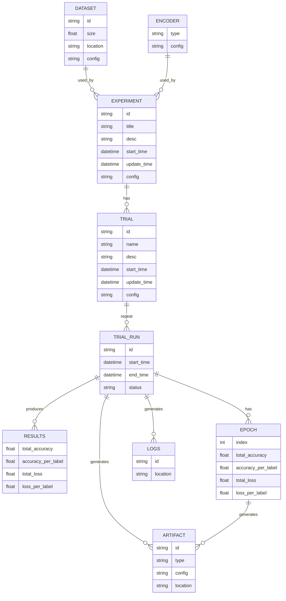

```mermaid
erDiagram
    EXPERIMENT ||--o{ TRIAL : has
    EXPERIMENT {
        string id
        string title
        string desc
        datetime start_time
        datetime update_time
        string config
    }
    TRIAL {
        string id
        string name
        string desc
        datetime start_time
        datetime update_time
        string config
    }
    TRIAL ||--o{ TRIAL_RUN : repeat
    TRIAL_RUN {
        string id
        datetime start_time
        datetime end_time
        string status
    }
    TRIAL_RUN ||--o{ RESULTS : produces
    TRIAL_RUN ||--o{ EPOCH : has
    TRIAL_RUN ||--o{ LOGS : generates
    TRIAL_RUN ||--o{ ARTIFACT : generates
    EPOCH ||--o{ ARTIFACT : generates
    RESULTS {
        float total_accuracy
        float accuracy_per_label
        float total_loss
        float loss_per_label
    }
    EPOCH {
        int index
        float total_accuracy
        float accuracy_per_label
        float total_loss
        float loss_per_label
    }
    DATASET {
        string id
        float size
        string location
        string config
    }
    DATASET ||--o{ EXPERIMENT : used_by
    ENCODER {
        string type
        string config
    }
    ENCODER ||--o{ EXPERIMENT : used_by
    ARTIFACT {
        string id
        string type
        string config
        string location
    }
    LOGS {
        string id
        string location
    }
```
